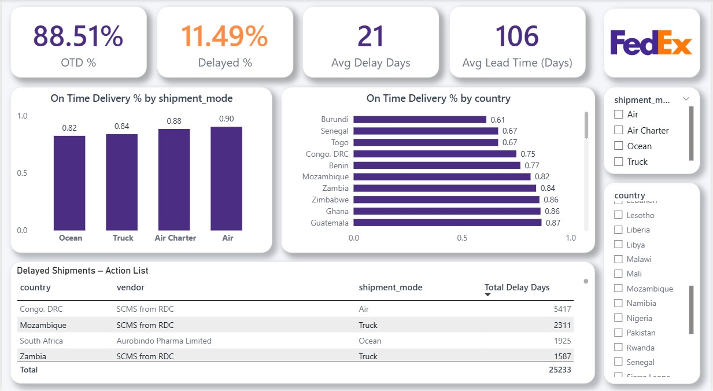

# FedEx Logistics Performance Dashboard



## 📌 Project Overview
This project analyzes logistics shipment performance data for FedEx to evaluate delivery reliability, delay patterns, and operational efficiency.  
The goal was to build an interactive Power BI dashboard that helps analysts and operations teams monitor KPIs and identify areas requiring action.

---

## 🧰 Tools & Technologies
- **Python (Pandas, NumPy)** – Exploratory Data Analysis (EDA) and data validation  
- **PostgreSQL (pgAdmin)** – Business logic and KPI computation using SQL  
- **Power BI** – Interactive dashboard creation and data storytelling  

---

## 📊 Data Understanding & Preparation (Python)
- Verified dataset structure and grain (shipment line-item level)
- Converted date and numeric columns to appropriate data types
- Analyzed missing values and retained NULLs where they represented valid business states
- Checked and confirmed absence of duplicate records

Notebook:  
📂 `notebooks/FedEx_Logistic_dataset.ipynb`

---

## 🧮 Business Logic & KPI Definition (SQL)
Business-truth KPIs were defined using SQL views, including:
- Delivery Status (On-Time / Delayed)
- Delay Flag
- Delay Days
- Lead Time (PO sent date → delivery date)

**Key KPIs:**
- On-Time Delivery % (OTD %)
- Average Lead Time (Days)
- Average Delay Days

SQL logic:  
📂 `sql/fedex_kpi_views.sql`

---

## 📈 Dashboard Design (Power BI)
The dashboard follows a clear analytical flow:
- **KPI Cards** – Overall delivery performance snapshot
- **Bar Charts** – OTD % by Country and Shipment Mode
- **Action Table** – Delayed shipments for operational follow-up
- **Interactive Slicers** – Country, Shipment Mode, Vendor

Power BI file:  
📂 `dashboard/FedEx_Logistics_Dashboard.pbix`

---

## 🔍 Key Insights
- Overall On-Time Delivery performance is ~88%, indicating strong delivery reliability
- When delays occur, the average delay duration is ~21 days
- Certain countries and shipment modes contribute disproportionately to delays

---

## 📄 Project Report
Detailed documentation covering business context, KPI logic, dashboard design, and insights:

📘 **[View Project Report (PDF)](report/FedEx_Logistics_Dashboard_Project_Report.pdf)**

---

## 🎥 Project Walkthrough Video
A 15-minute walkthrough explaining the project flow, KPIs, and dashboard insights:

▶️ **[Watch Project Explanation Video](https://drive.google.com/file/d/13AhCE4CA98AwVtI0TlzvHWp4J9yzJC3h/view?usp=sharing)**


---

## 📁 Repository Structure
```
data/ → Raw and cleaned datasets
notebooks/ → Python EDA and data validation
sql/ → Business logic and KPI definitions
dashboard/ → Power BI dashboard file
images/ → Dashboard preview images
report/ → Project documentation

```

---

## 🎯 Conclusion
This project demonstrates an end-to-end, industry-aligned analytics workflow where:
- Python is used for exploration and validation  
- SQL defines business-truth KPIs  
- Power BI delivers insights through clear, interactive storytelling.

The dashboard supports both executive-level monitoring and operational decision-making.

